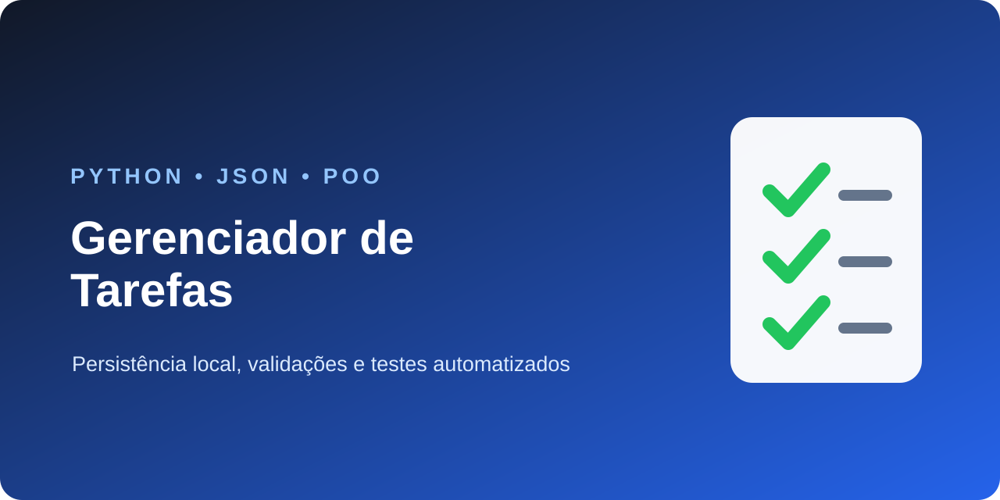

<div align="center">

# Gerenciador de Tarefas em Python


</div>

Aplicação de terminal criada para organizar tarefas e praticar orientação a objetos, persistência em JSON e testes automatizados.

## Funcionalidades

- cadastrar e listar tarefas;
- marcar tarefas como concluídas;
- remover tarefas;
- salvar os dados automaticamente em JSON;
- validar descrições vazias e IDs inválidos.

## Como executar

```bash
python gerenciador.py
```

Não é necessário instalar bibliotecas externas.

## Como testar

```bash
python -m unittest -v
```

O arquivo `tarefas.json` é criado durante o uso e permanece fora do GitHub.

## Tecnologias e conceitos

Python · orientação a objetos · JSON · pathlib · listas · dicionários · tratamento de erros · unittest

---

Desenvolvido por [Nicolas Marques](https://github.com/NicolasMarquesSousa) · [Ver portfólio](https://github.com/NicolasMarquesSousa)
